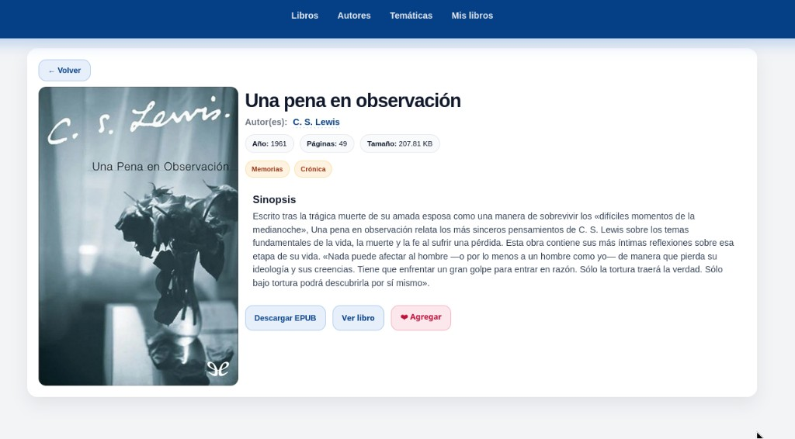

# libraryEPub

Aplicacion full-stack para explorar una biblioteca EPUB.

Este proyecto es una mejora del indexador de la Biblioteca Secreta: utiliza una base de datos construida a partir de libros provenientes del torrent de la biblioteca, y genera portadas (incluyendo thumbnails) a partir del contenido de cada archivo EPUB.

Para el pipeline de imagenes se utilizaron scripts en Python:
- un script que genera las portadas a partir de los libros EPUB,
- y otro script en Python que genera los thumbnails a partir de esas portadas.

Referencia del proyecto/origen de catalogo: http://bibliotecasecreta.nl/

Contexto y credito:
- Este proyecto nace como sustitucion/mejora del indexador incluido en el torrent de Biblioteca Secreta.
- El indexador original se asocia publicamente al alias **MR. Fado**.
- Este repositorio implementa una alternativa tecnica de indexacion, navegacion y visualizacion de metadatos/portadas.

Incluye:
- **Frontend Angular** para listado, filtros A-Z, detalle de libro y visor EPUB.
- **Backend Spring Boot** para API REST, acceso a PostgreSQL y servicio de archivos EPUB/portadas.
- **Docker Compose** para desplegar frontend + backend.

---

## 1) Stack tecnologico

### Backend
- Java 17
- Spring Boot 3.2.x
- Spring Web, Validation, Spring Data JPA
- PostgreSQL
- Flyway (migraciones)

### Frontend
- Angular 21 (standalone components)
- RxJS
- `epubjs` para lectura EPUB en modal
- CSS custom (sin framework UI)

### Infraestructura
- Docker / Docker Compose
- Nginx (frontend container + reverse proxy a backend)

---

## 2) Estructura del proyecto

```text
libraryEPub/
├── backend/
│   ├── src/main/java/com/libraryepubapi/
│   │   ├── config/
│   │   ├── dto/
│   │   ├── entity/
│   │   ├── repository/
│   │   ├── service/
│   │   └── web/
│   ├── src/main/resources/
│   │   ├── db/migration/
│   │   └── application.yml
│   ├── build.gradle
│   └── Dockerfile
├── frontend/
│   ├── src/app/
│   │   ├── components/
│   │   ├── models/
│   │   ├── pages/
│   │   ├── services/
│   │   ├── app.html
│   │   └── app.css
│   ├── nginx.conf
│   ├── proxy.conf.json
│   ├── package.json
│   └── Dockerfile
├── docker-compose.yml
└── .gitignore
```

---

## 3) Funcionalidades principales

- Lista de libros con:
  - portada
  - autor(es)
  - año y paginas
  - filtro por letra (A-Z)
  - busqueda
  - paginacion
  - boton de "Me gusta"
- Listado de autores y tematicas (labels) con filtro A-Z.
- Detalle de autor/tematica con sus libros relacionados.
- Detalle de libro con:
  - portada, metadata y sinopsis
  - descarga de EPUB
  - visor EPUB embebido (paginado + navegacion)
- Pantalla "Mis Libros" para ver favoritos.
- Persistencia de estado de navegacion al volver:
  - conserva pagina/filtros en URL (query params)
  - restaura scroll por ruta
- Persistencia de favoritos en base de datos por dispositivo/navegador (UUID de cliente).
- Portadas optimizadas con soporte de thumbnails (`/covers/thumbs/...`).

---

## Capturas de la web

### Inicio / listado de libros


### Detalle de libro


### Mis Libros (favoritos)


---

## 4) Configuracion y variables

### Backend (`backend/src/main/resources/application.yml`)
Configuracion base:
- `server.port=8080`
- datasource PostgreSQL
- Flyway habilitado

Variables importantes (sobrescribibles por entorno):
- `SPRING_DATASOURCE_URL`
- `SPRING_DATASOURCE_USERNAME`
- `SPRING_DATASOURCE_PASSWORD`
- `EPUB_STORAGE_BASE_PATH` (ruta donde estan los `.epub`)

### Docker Compose (`docker-compose.yml`)
- Backend expuesto en `18081:8080`
- Frontend expuesto en `4200:80`
- Volumenes montados:
  - EPUBs (`/srv/library/epubs`)
  - Portadas (`/srv/library/covers`)

---

## 5) Ejecucion local (sin Docker para frontend)

### Backend
```bash
cd backend
./gradlew bootRun
```

### Frontend
```bash
cd frontend
npm install
npm start
```

El frontend usa `proxy.conf.json` para enviar `/api` al backend local.

---

## 6) Ejecucion con Docker Compose

Desde la raiz del proyecto:

```bash
docker-compose up -d --build backend frontend
```

URLs:
- Frontend: `http://localhost:4200`
- Backend API: `http://localhost:18081/api`

---

## 7) Endpoints principales

### Books
- `GET /api/books?page=1&size=20`
- `GET /api/books/search?q=...&page=1&size=20`
- `GET /api/books/{bookId}`
- `GET /api/books/{bookId}/file`
- `GET /api/books/by-title-prefix/{prefix}?page=1&size=20`
- `GET /api/books/by-author/{authorId}?prefix=A&page=1&size=20`
- `GET /api/books/by-label/{labelId}?prefix=A&page=1&size=20`

### Authors
- `GET /api/authors?page=1&size=20`
- `GET /api/authors/{authorId}`
- `GET /api/authors/search?prefix=A&page=1&size=20`

### Labels
- `GET /api/labels?page=1&size=20`
- `GET /api/labels/{labelId}`
- `GET /api/labels/search?prefix=A&page=1&size=20`

### Favorites (por dispositivo)
- `GET /api/favorites` (requiere header `X-Client-Id`)
- `POST /api/favorites/{bookId}` (requiere header `X-Client-Id`)
- `DELETE /api/favorites/{bookId}` (requiere header `X-Client-Id`)

Respuesta de paginado estandar:

```json
{
  "page": 1,
  "size": 20,
  "totalElements": 123,
  "totalPages": 7,
  "items": []
}
```

---

## 8) Portadas y rendimiento

- Portada full-size: `/covers/{sha256}.webp`
- Thumbnail para listas: `/covers/thumbs/{sha256}.webp`
- Frontend usa thumbnails en la grilla de libros para carga mas rapida.
- Nginx aplica cache largo para `/covers/` (immutable + max-age).

---

## 9) Build y utilidades

### Frontend
```bash
cd frontend
npm run build
```

### Backend
```bash
cd backend
./gradlew build
```

---

## 10) Notas de mantenimiento

- Si cambias DTOs backend, reconstruye backend y frontend en Docker.
- Si cambias `nginx.conf`, reconstruye la imagen frontend.
- Usa `.gitignore` de raiz para evitar subir artefactos (`build/`, `.gradle/`, `node_modules/`, etc.).

